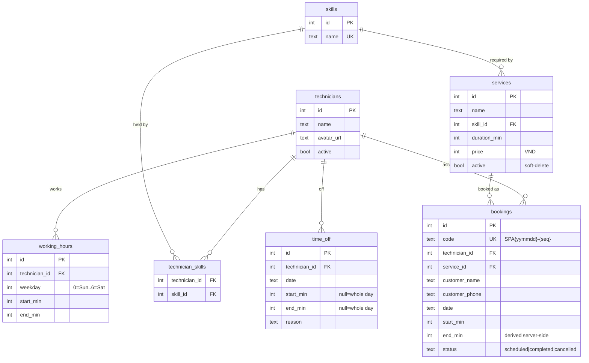
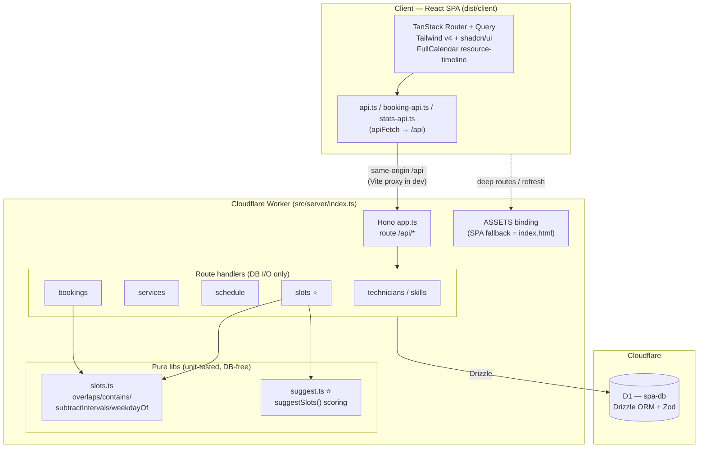
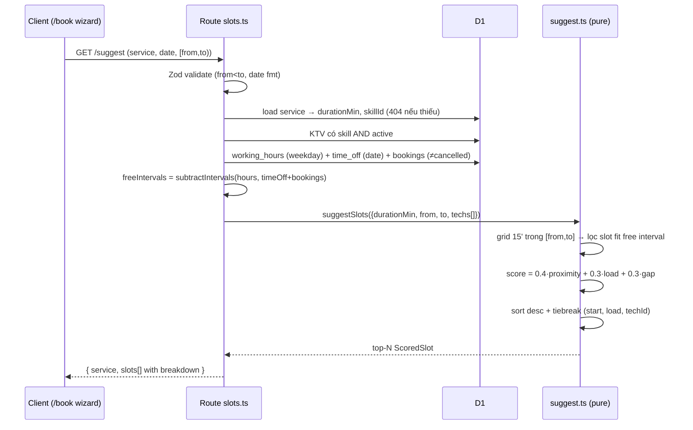
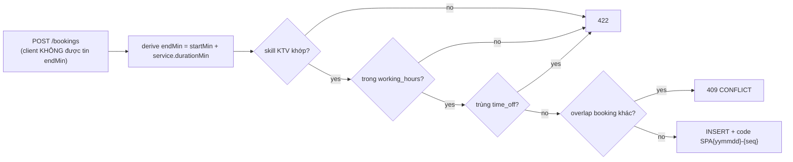
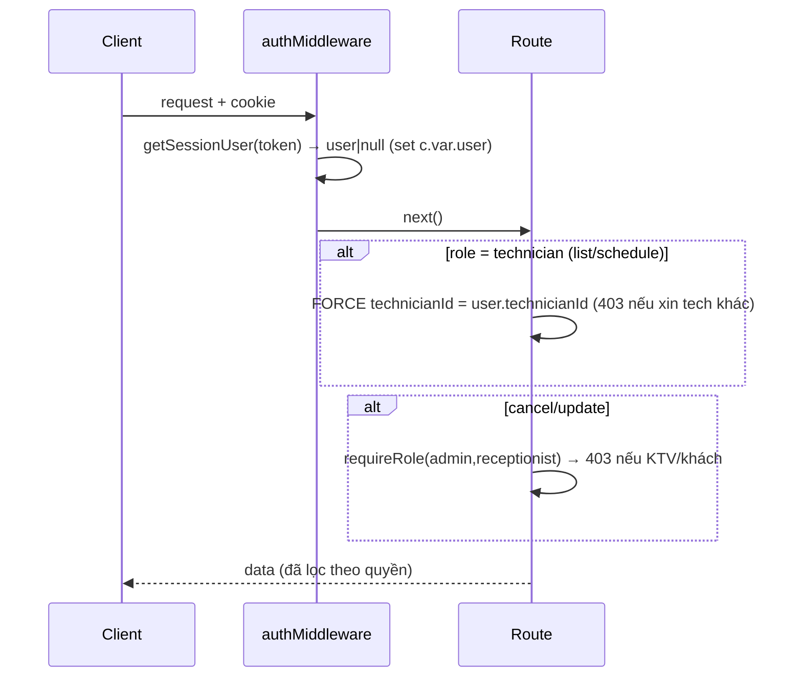
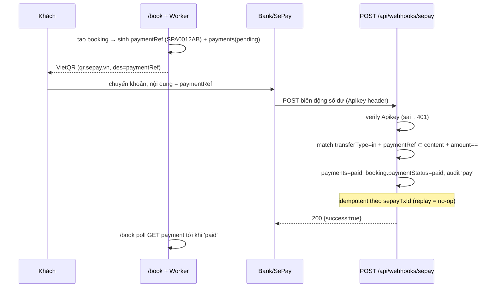

# Spa Scheduling Optimizer — App Overview & Architecture

> Tài liệu này viết cho AI đọc (concise, không phải human-facing). Nguồn sự thật là code; đọc lại code khi nghi ngờ.

## 1. Bài toán (Problem)

Một spa có nhiều **kỹ thuật viên (KTV / technician)**, mỗi người có **kỹ năng (skill)** khác nhau và **giờ làm việc / nghỉ phép** riêng. Khách đặt **dịch vụ (service)** — mỗi dịch vụ cần đúng 1 skill và có thời lượng cố định.

Vấn đề vận hành:
- Xếp lịch thủ công dễ **double-booking** (2 khách trùng giờ 1 KTV).
- Nhân viên lễ tân khó biết **khung giờ nào còn trống** với KTV đủ kỹ năng.
- Xếp lịch không tối ưu → KTV người quá tải người rảnh, và để lại **khoảng trống lẻ** (ví dụ 20 phút) không đặt được gì → lãng phí công suất.

## 2. Business Outcome

| Outcome | Cơ chế trong app |
|---|---|
| **Không bao giờ double-book** | Invariant kiểm tra lại server-side ngay trước INSERT (overlap → HTTP 409). Không tin `endMin` client gửi. |
| **Đặt lịch nhanh hơn** | Tính năng lõi **"Gợi ý khung giờ trống"** (`suggestSlots`) — trả về top slot đã chấm điểm & xếp hạng, lễ tân/khách chỉ việc chọn. |
| **Tăng công suất, cân tải KTV** | Điểm số 3 thành phần: gần giờ khách muốn + cân bằng tải KTV + giảm khoảng trống lẻ chết. |
| **Tự phục vụ (self-service)** | Wizard `/book` cho khách tự đặt, không cần tài khoản. |
| **(P2) Phân quyền & định danh** | Login + role (admin/receptionist/technician); KTV chỉ thấy lịch của mình. |
| **(P2) Thu tiền qua chuyển khoản** | VietQR + đối soát webhook SePay → booking `paid` tự động. |
| **(P2) Báo người làm** | Email (Resend) cho KTV khi có booking mới / đã thanh toán. |
| **(P2) Truy vết & chẩn đoán lỗi** | Audit trail (ai tạo/sửa/hủy) + error taxonomy phân tầng (biết lỗi ở UI/API/quyền/DB/logic). |

**Non-goals (KHÔNG làm):** Google Calendar sync, multi-branch, multi-tenant, membership/loyalty, SMS, online meeting.
**Phase 2 đã BẬT (trước là non-goal):** auth/login + role, payment (SePay VietQR), email (Resend). Xem §6.

## 3. Domain Model

Quy ước xuyên suốt:
- **Thời gian = số nguyên phút-từ-nửa-đêm** (09:00 = 540). Ngày = chuỗi ISO `yyyy-mm-dd`.
- **Weekday: 0=Chủ nhật .. 6=Thứ bảy**.
- **Interval nửa mở `[start, end)`** → booking sát nhau không xung đột.

Ghi chú không hiển nhiên:
- `services.skillId` **bắt buộc** → mỗi dịch vụ khoá vào đúng 1 skill; chỉ KTV có skill đó mới nhận được.
- `time_off` với `start/end = null/null` = **nghỉ cả ngày**.
- Xoá là **soft-delete**: hủy booking = `status='cancelled'`; xoá service = `active=false`.

### 3b. Domain Phase 2 (thêm 4 bảng, tổng 11 bảng)

```mermaid
erDiagram
    users        ||--o{ sessions : "has"
    users        ||--o| technicians : "links (role=technician)"
    users        ||--o{ audit_log : "acts"
    bookings     ||--o{ payments : "paid via"
    bookings     ||--o{ audit_log : "tracked by"

    users {
        int id PK
        text username UK
        text password_hash "PBKDF2"
        text role "admin|receptionist|technician"
        int technician_id FK "null unless technician"
        bool active
    }
    sessions {
        text id PK "opaque token (cookie)"
        int user_id FK
        int expires_at "unix sec"
    }
    payments {
        int id PK
        int booking_id FK
        text payment_ref UK "A-Z0-9, VietQR content"
        int amount "VND"
        text method "sepay|cash"
        text status "pending|paid|failed"
        text sepay_tx_id "webhook tx, idempotency key"
        text raw_payload "webhook JSON"
    }
    audit_log {
        int id PK
        int booking_id FK
        int user_id FK "null = customer"
        text action "create|update|cancel|pay"
        text old_values "JSON"
        text new_values "JSON"
    }
```

Cột thêm vào `bookings`: `payment_status` (unpaid|paid, denormalize), `payment_ref` (denormalize để hiện QR), `created_by_user_id` (null = khách tự đặt). Cột thêm `technicians.email` (nullable, nơi gửi notify).

Ghi chú P2:
- **Session** = token đục lưu D1, cookie HttpOnly `spa_session`; password PBKDF2 (Web Crypto, `pbkdf2$iters$salt$hash`). Không dùng lib nặng.
- **payment_ref tách khỏi booking.code** (code có `-`, bank/OCR nuốt mất) → dạng `SPA0012AB`.
- **audit_log append-only, best-effort**: ghi SAU khi mutation commit; lỗi ghi audit không làm hỏng nghiệp vụ.

## 4. Kiến trúc kỹ thuật (Tech Architecture)

Một **Cloudflare Worker duy nhất** vừa chạy API vừa serve SPA.

Điểm cốt lõi kiến trúc:
- **Tách pure/impure:** `lib/*` thuần logic (không chạm DB) → test được không cần DB. Route handler chỉ load DB + shape data rồi gọi lib.
- **`slots.ts`** dùng chung cho cả bookings (chống trùng) và slot-suggestion → 1 nguồn logic interval.
- **SPA fallback** qua `wrangler.toml` `not_found_handling = "single-page-application"` để deep route (`/book`, `/technicians`) và refresh trả `index.html`.

## 5. Data Flow — Tính năng lõi: Gợi ý khung giờ

`GET /api/slots/suggest?serviceId=&date=&from=&to=&limit=`

### Công thức chấm điểm (mỗi rule ∈ [0,1], cao = tốt)

`score = 0.4 × proximity + 0.3 × load + 0.3 × gap`

| Rule | Weight | Ý nghĩa | Công thức |
|---|---|---|---|
| **Proximity** | 0.40 | Gần giờ khách muốn (mốc = `from`) | `max(0, 1 − (start−from)/span)`, `span=max(to−from, 15)` |
| **Load balance** | 0.30 | KTV ít việc hơn được ưu tiên | `1 / (1 + bookingCount)` |
| **Gap min** | 0.30 | Tránh để lại mảnh trống chết (<30') | `max(0, 1 − deadWaste/30)` |

- Grid start bám mốc đồng hồ (:00/:15/:30/:45), không bám mép interval.
- `MIN_BOOKABLE_MIN = 30`: mảnh trống < 30' coi như chết (không đặt được gì).

## 6. Data Flow — Chống double-booking

`POST /api/bookings` — invariant then-insert:

`endMin` **luôn** được server tự tính lại từ `service.durationMin` — không trust client. Re-validate ngay trước INSERT nên không có race window logic.

## 6b. Data Flow — Phase 2

### Auth + RBAC (yêu cầu #2 #3)
`authMiddleware` chạy app-wide: đọc cookie `spa_session` → set `c.var.user` (hoặc null, không reject). Guard: `requireAuth` (401), `requireRole(...)` (403).

### SePay payment (yêu cầu #1) — đối soát webhook, KHÔNG redirect

### Error taxonomy (yêu cầu #6)
`AppError(category, code, httpStatus)` → `app.onError(appOnError)`: trả `{error:{code,category,message}}` + log JSON có `requestId` ra Cloudflare Tail. Category = tầng lỗi: **VALIDATION** (input/skill/hours), **AUTH** (chưa login/không đủ quyền), **BUSINESS** (overlap/status), **DB**, **EXTERNAL** (SePay/email). Nhìn `category` biết ngay lỗi ở tầng nào.

### Email notify (yêu cầu #4)
Sau create-booking & sau payment-paid → `sendEmail` (Resend HTTP) tới `technician.email`, **fire-and-forget** qua `waitUntil`. `sendEmail` không bao giờ throw (lỗi → log `EXTERNAL_EMAIL`, `{ok:false}`); booking/payment vẫn thành công dù email hỏng hoặc chưa set key.

## 7. Bảng route API

| Mount | Nội dung |
|---|---|
| `/api/auth` | (P2) login / logout / me — session cookie |
| `/api/technicians`, `/api/skills` | CRUD KTV + skills (M2M) |
| `/api/services` | CRUD dịch vụ (soft-delete) |
| `/api/schedule` | Dữ liệu timeline (FullCalendar) — RBAC-scoped cho KTV |
| `/api/bookings` | Đặt/hủy booking + invariant chống trùng; (P2) `/:id/payment`, admin `/:id/audit` |
| `/api/slots` | ⭐ `GET /suggest` — engine gợi ý (public) |
| `/api/webhooks` | (P2) `POST /sepay` — đối soát thanh toán (public, Apikey) |

## 8. Commands (tham chiếu nhanh)

- `npm run dev` — vite + wrangler dev
- `npm run build` / `npm run deploy`
- `npm test` — vitest cho `src/server/lib/*` (86 tests)
- `npm run db:generate` / `db:migrate` (local) / `db:seed`
- Remote migrate: `npx wrangler d1 migrations apply spa-db --remote`
- Typecheck: `npx tsc --noEmit -p tsconfig.app.json` (client) / `-p tsconfig.server.json` (server)
- Secrets (P2, đặt trước khi deploy): `wrangler secret put SEPAY_WEBHOOK_TOKEN|SEPAY_BANK|SEPAY_ACCOUNT_NUMBER|SEPAY_ACCOUNT_NAME|RESEND_API_KEY|EMAIL_FROM`
- Seed users: `admin` / `letan` / `ktv1..5`, mật khẩu `spa123` — **đổi trước production**.
